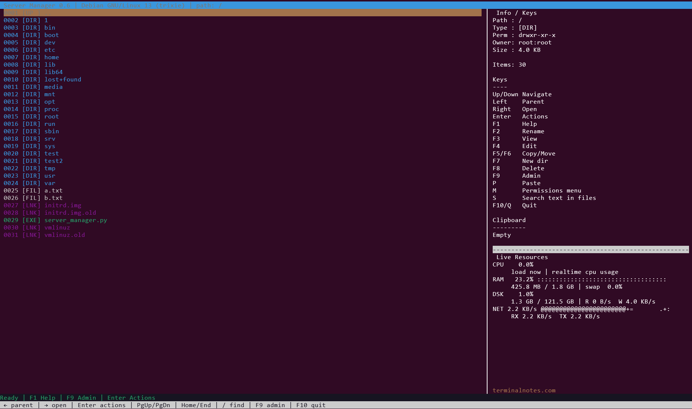
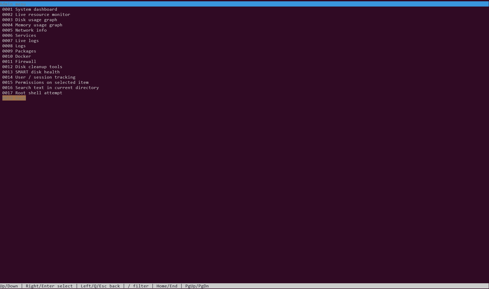

# Server Manager

A terminal-based server management and file operations tool for Linux systems.

### Main screen

### Admin menu

`Server Manager` is a curses-based TUI application that combines:

- file browsing
- file previews and editing
- copy/move/archive/extract operations
- permission management (`chmod`, `chown`, `chgrp`)
- system administration helpers
- logs and service inspection
- package update helpers
- docker shortcuts
- firewall helpers
- disk cleanup tools
- live system resource monitoring

## Features

### File manager
- Navigate directories
- Preview text files
- Edit files with your preferred editor
- Rename files and folders
- Create directories
- Copy / move / paste
- Trash or permanent delete
- Archive to `.zip` or `.tar.gz`
- Extract `.zip`, `.tar`, `.tar.gz`, `.tgz`, `.tar.bz2`, `.tbz2`

### Permissions
- `chmod` preset modes
- `chown`
- `chgrp`

### Admin tools
- System dashboard
- Live CPU / RAM / disk / network monitoring
- Disk and memory usage reports
- Network information
- Service inspection and restart/stop helpers
- Log viewing and live journal follow
- Package update / upgrade shortcuts
- Docker container shortcuts
- Firewall helpers (`ufw` / `firewalld`)
- SMART disk health
- User / session tracking
- Search text inside files

## Requirements

- Linux
- Python 3.8+
- A terminal with curses support
- Recommended: `systemd`-based Linux distribution

This project is primarily designed for:
- Debian / Ubuntu
- RHEL / CentOS / Rocky / AlmaLinux / Fedora

## Installation

### Quick install

git clone https://github.com/ali-durmus/server-manager.git
cd server-manager
chmod +x install.sh
./install.sh

### After installation, run:

server-manager

### Manual run

You can also run it directly without installing:

python3 server_manager.py

### Uninstall

./uninstall.sh

## Notes

Some actions may require root privileges.
On some systems, commands such as docker, smartctl, ufw, firewall-cmd, journalctl, or systemctl may not be available.
The application is Linux-only.
The app stores state in:
~/.server_manager_state.json
~/.server_manager_trash
Key bindings
Main navigation
Up/Down navigate
Left parent directory
Right open directory
Enter actions menu
Home/End jump
PgUp/PgDn page jump
Esc cancel
Function keys
F1 help
F2 rename
F3 view file
F4 edit file
F5 queue copy
F6 queue move
F7 create folder
F8 delete menu
F9 admin menu
F10 quit
Other keys
P paste
M permissions
S search inside files
/ jump to first match in current directory

## Security / Safety

This tool is intended for trusted Linux server environments.

Please review the code before using it in production. Some operations execute shell commands and some archive extraction logic may be improved in future versions for stricter safety.

## Roadmap

Planned future improvements:

safer archive extraction
cleaner command execution wrappers
modular code structure
config file support
better search
batch operations
improved non-root handling
packaging as a proper Python package

## License
MIT
